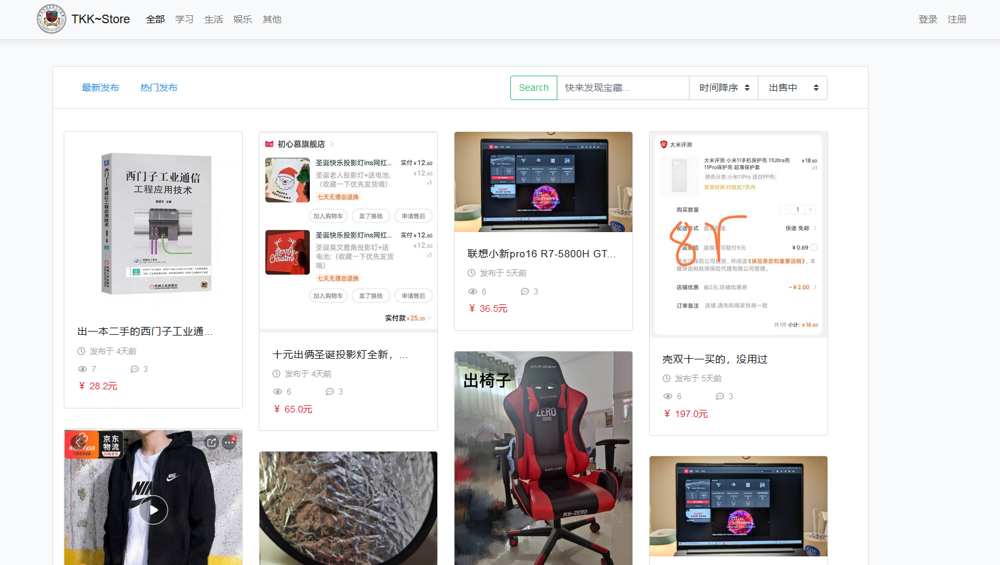
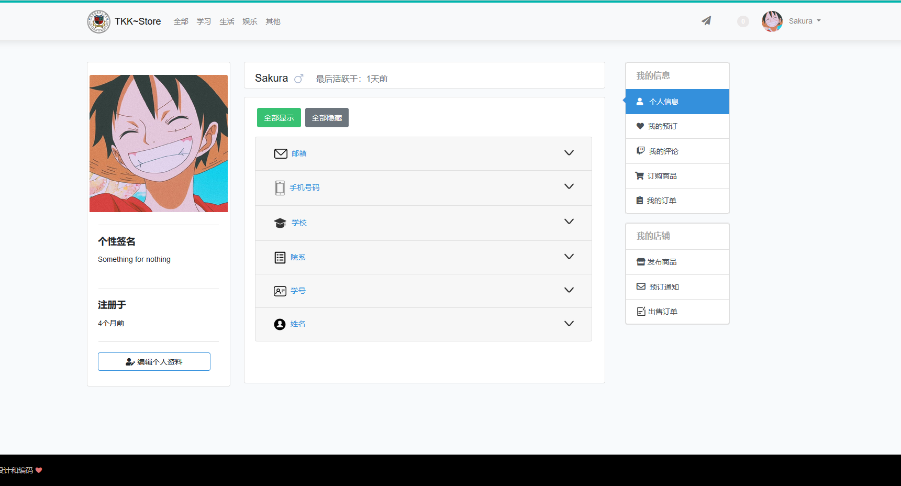

# 基于 Laravel 校园二手交易平台

#### 图片展示







本人也是刚接触 Laravel，跟着 Learnku 中文文档项目学习。项目代码比较简单(纪念一下)。欢迎大家一起学习交流，

#### 相关技术

- Laravel-admin（后台）
- MySQL
- Redis
- jQuery
- Axios
- Laravel 7

#### 功能模块

##### 用户模块

- 登录注册
- 邮箱验证
- 个人中心
- 编辑资料

##### 商品模块

- 最新商品
- 商品搜索
- 商品分类
- 热门商品
- 商品详情
- 发布商品
- 编辑商品

##### 预定模块

- 预定商品

##### 评论模块

- 评论商品

##### 订单模块

- 商品订单

- 订单超时
- 消息通知

#### 安装

##### composer

```shell
composer install	# php8， update
```

##### 前端依赖

```
SASS_BINARY_SITE=http://npm.taobao.org/mirrors/node-sass yarn
```

##### .env 文件

```
QUEUE_CONNECTION=redis	# 开启 redis 驱动
```

使用 QQ 邮箱，先开启 SMTP 支持。如何打开 POP3/SMTP/IMAP 功能？http://service.mail.qq.com/cgi-bin/help?subtype=1&id=28&no=166

```shell
MAIL_MAILER=smtp
MAIL_HOST=smtp.qq.com
MAIL_PORT=25			# SMTP 服务器端口
MAIL_USERNAME=xxx@qq.com	# 你的QQ
MAIL_PASSWORD=xxx	# 你的授权密码
MAIL_ENCRYPTION=tls		# tls端口
MAIL_FROM_ADDRESS=xxx@qq.com	# 和 MAIL_USERNAME 一致
```

#### 执行数据库迁移

```php
php artisan migrate
php artisan db:seed
```


